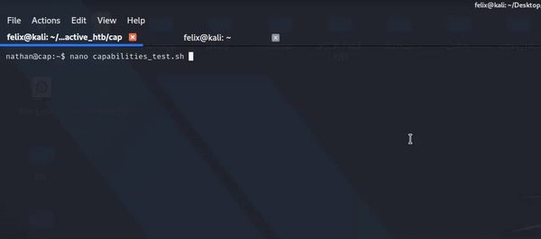
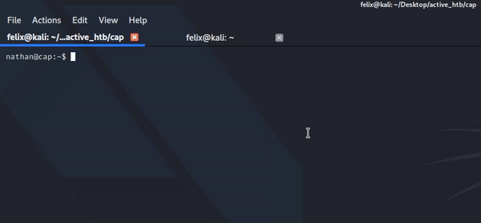

# What does this script do?

This is an automated Privilege Escalation script that will look for python capabilities on the system, if it finds a capability it will ask the user if they would like to exploited it, however if the script doesn't find any capabilities it will then exit.  
 

# Proof of Concept

<h3> Finding and exploiting </h3>

<h3> Did not find any capabilities </h3>

