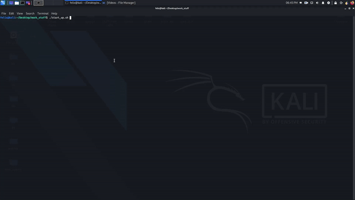

# What does this script do?

It will automate one of my work tasks by starting up 3 processes with a delay inbetween. Each task will be opened in a new terminal so that the process can still be monitored after the task is executed, it will also state what task is being started then confirm that is is running.
 

# Proof of Concept

